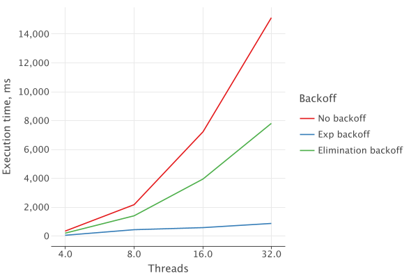
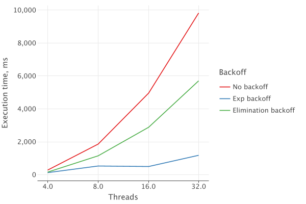

# lock-free stacks
The goal of this work is to compare performance of 3 different implementations of lock-free stack data structure.

Considered implementations are:
- [Treiber stack](https://en.wikipedia.org/wiki/Treiber_stack) (no backoff)
- Treiber stack with exponential backoff
- Treiber stack with [elimination backoff](https://people.csail.mit.edu/shanir/publications/Lock_Free.pdf)

## Testing parameters & environment
Optimal backoff parameters for exponential and elimination stacks were chosen empirically.

- For _exponential backoff stack_ min backoff duration was set to `10ns`, max - `50ns`.
- For _elimination backoff stack_ elimination array capacity was set to be `1/2 of threads amount` 
and max elimination duration was set to `50ns`.

All tests were run on `Macbook Pro 14-inch M3 Pro 11-Core, 18GB memory` 
running `macOS Sonoma 14.5, Azul Zulu Java 21.0.3, Kotlin 1.9.23`.

## Testing scenarios & results
To assess performance the following testing was performed:
- Stack was initially filled with `2 000 000` elements.
- Multiple threads were started and each performed `1 000 000` stack operations.
- Total time to perform all operations by all threads was measured.

### 100% push

First let's set all performed operations to be `push`. The following results are obtained:

It can be seen that while `elimination backoff` significantly outperforms `no backoff`, 
`exp backoff` is much more performant than others.

It's important to note that on 100% push operations no eliminations can happen. 
That means that all the performance boost that `elimination backoff` provides here is due to added time between CAS retries.

### 50% push / 50% pop

Such operations distribution should be ideal for elimination backoff due to a lot of amount of eliminations that can happen.

However it can be seen that `exp backoff` still outperforms `elimination backoff` even in the ideal setting for the latter.

## Summary
In the presented testing exponential backoff consistently outpeforms elimination backoff.
